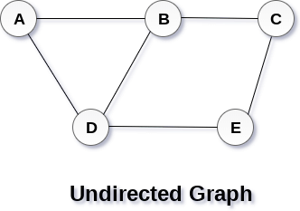

# Data Structure

## **Data Structure**
***
- Data Structure are fundamental concepts of computer science which helps us to write efficient program
- Organizing and storing data in a efficient form in the memory

### **Differents Types of Data Structure**
***
* **1. Primitve Data Structure**
* **2. Non- Primitive Data Structure**

- **Primitve Data Structure**
  - Predefine way of storing data
  - |         |
    |----|
    | int     |
    | char    |
    | float   |
    | double  |
    
- **Non-Primitve Data Structure**
  - Derive from primitive data structure
  - **Linear**
   - |       |
     |-------|
     | Array |
     | Linkedlist |
     | Stack |
     | Queue |
     
  - **Non-Linear**
   - |         |
     |---------|
     | Tree |
     | Graph |
     | Binary Tree |
     | Binary Search Tree |
     
 ### Operation perform on Data Structure
 ***
   - Searching
   - Sorting
   - Insertion
   - Deletion
   - Updation
   
 ### Areas where Data Structure use
 ***
   - Manage large amount of Data Efficiently
   - Internet Indexing services provided by Google
   - Hierarchical Data Model - Tree
   - RDBMS - Arrays
   - Network Data Model - Graph
   
  
 ### **Array**
 ***
   - Collection of elements of Homogeneous Data types
   - Size is fixed
   - Occupy Contiguous Memory Location
   - Searching O(1) Constant time
   - Indexes start from 0 & ends with Size - 1
   
- **Operations**
   - |Searching|
     |---------|
     | Linear Search |
     | Binary Search |
   - | Sorting  |
     |----------|
     | Insertion Sort |
     | Bubble Sort |
     | Radix Sort |
     | Merge Sort |
     | Binary Sort |
   - | Insertion |
     |-----------|
     | Insert at start |
     | Insert at end 
     | Insert at any specific location |
     
   - | Deletion |
     |----------|
     | Delete at start |
     | Delete at end |
     | Delete at any specific location |
   
 - ```code
      int arr[5];
      |  1 |  2  |  3  |  4  | 
      |5000|           | 5010|
      arr[0]           arr[4]
      base address 5000
   ```
   
- **Advantages of Array**
   - Similar Data type Element
   - Random Access with the help of index value
   - Suitable When Size is knowned
   - Implement Stack and Queue
   
- **Disadvantages of Arrays**
   - Static Memory Location
   - Specify the time at compile time, **Not Dynamic**
   - Insertion and Deletion -> More Complex / Time Complexity
   - Due to this we can't implement the list using arrays
   
 
 
### **LinkedList**
***
   - In LinkedList, elements stores at any location in the memory instead of contiguous like array
   - As its name indicates, There is a **Link** between one one element and other element which is called **Node**
   - ```code
        | Data | Link |
            Node
       value    Add of next node
                  that's why not required contiguous memory
               
        
        | 10 I 1000 | --> | 20 I 2000| --> | 30 I 3000| --> | 40 I NULL|
          Head                                                 Tail
          start node                                           end node
     ```
     
 
- **Advantages of LinkedList**
   - No Wastage of Memory
   - No need to contiguous memory
   - Insertion and deletion, more simpler than Array
   - Stack and Queue can be implemented by using LinkedList 
   - Can Store any data types in Node
   
- **Disadvantages Of LinkedList**
   - Random Access not possible
   - Binary Search Algorithm is not possible because of no index value
   - Only forward traversal is possible
   - Reversing a Linkedlist is complex, because change all links of all nodes
   - Extra pointer Require to store address for each node
  
* **Singly LinkedList**
  - A LinkedList or Singly LinkedList is a set of nodes where each nodes has two fields, **Data** and **Link**
  - ```code
     Data              Link
     Actual value       add of next node
     
    ```

* **Doubly LinkedList**
   - Doubly linkedList contains an extra pointer or link typically called previous node address with the next node address and a data field like singly LinkedList
   - ```code
          | 500 |  A  | 1000 |
       prev add   data   next add
        
     ```
* **Circular LinkedList**
   - Linkedlist where all nodes are connected to form a circle
   - There is no NULL at the end
   - A Circular LinkedList can be a singly LinkedList or Doubly LinkedList
   - ```code
         | 2 | x |-->| 3 | y |--->| 3 | z |--->| 2 | x |
     ```
     
- **Advantage of Circular LinkedList**
   - Any nde can be starting point
   - Traverse whole list by start at any point, just need to to stop when the first value is revisited
   - Useful for Queue implementation, we don't need to maintain two pointers for Front and Rear if we use circular LinkedList
   - Real Time Example, **Operating System** manages all running application through circular linkedList to give each of them a slice of time quantum to execute
   - Circular Doubly Linked Lists are used for implementation of advanced data structures like Fibonacci Heap.
   - Circular linked list is the basic idea of round robin scheduling algorithm
   


### **Stack**
***
   - Linear Data Structure
   - All the elemets are arrange in a sequential manner
   - Follows **LIFO** Last in First Out approach
   - Example - Arranging Bread in a Packet

- **Operations**
   - **Push**  - Inserting an element on the top of stack
   - **Pop**   - Deleting an element from the top of stack
   
   > ***Both opertion are perform on the top of stack***
  
   > **Top = -1 indicates Stack is Empty**
   
 - | **Overflow Condition** | **Underflow Condition** |
   |------------------------|-------------------------|
   |         PUSH           |        POP              |
   | If we are trying to insert element to stack when stack is already have maximum element | If we are trying to delete an element from stack when stack is empty already |


- **Implementation**
   - Using Array
   - Using LinkedList


### **Queue**
***
   - Linear Data Structure
   - ALl the elements are arrange in Sequential Manner
   - Follows **FIFO** First In First Out approach
   - Example - Railway Ticket Counter Queue
   
- **Operations**
   - **Enqueue** - Inserting an element into the Queue
   - **Dequeue** - Deleting an element from the Queue
   
   > **Front - Points to the starting element**
   > **Rare  - Points to the last element**
   - ***Enqueue will be done at Rare***
   - ***Dequeue will be done at Front***
   - | **Overflow** | **Underflow** |
     |--------------|---------------|
     | Trying to insert element into Queue when it is full | Trying to delete element from Queue when it is empty |
     
   - Initially **Front == Rear == -1** Empty Queue
   
- ```code                   Queue
        Delete <--- |    |    |    |    |............|     | <---- insert
                     front                            rear
                     dequeue                           enqueue
  ```
  
- **Implementation**
   - Using Array
   - Using LinkedList
   
 
- **Application of Stack**
     - Evaluation of a Post Expression
     - Conversion of Infix Expression to Postfix Expression and Vice Versa
     - Balancing the Parathesis
     
- **Prefix Expression**
     - Example +AB
     - ```code
          Operator <operand1> <operand2>
       ```

- **Infix Expression**
     - Example A+B
     - ```code
         <operand> Operator <operand>
       ```
 
- **Postfix Expression**
     - Example AB+
     - ```code
          <operand1> <operand2> Operator
       ```


## **Tree**
***
   - Non-Linear Data Stucture, in which data is organised in Hierarchical fashion
   - Represent hierarchical data.
   - Hierarchical structure as elements in a Tree are arranged in multiple levels
   - 
   
   > **Organizing the elements witout any closed region or loop is called as Tree otherwise it forms a Graph**
   
- ```code                     Top
                       A       | ------------------ Level 0
                               |
                  B        C   | ------------------ Level 1
                               |
             D    E    F       | ------------------ Level 2
                               |
                G    H         | ------------------ level 3
                               V
                             Bottom
  ```
  
- **Node**
   - ***Node means elements of a tree is called Node***
   - Example - A, B, C, D, E, F, G, H are Nodes of a tree

- **Root**
   - ***The starting element or Node of a tree is called Root Node***
   - Example A is the root node of the tree
   > **Tree will have only one Root Node**
   
- **Edge**
   - ***Edge is a link or connection between two nodes***
   > **If There are N nodes in a tree then N-1 Edges are there**
   - Example There are 8 nodes in the tree that's why 7 edges are there
   
   
- **Parent Node**
    - ***The node which is having branches, means Child is called as Parent Node***
    - Node with branches from top to bottom
    - ```code
                A (parent)
              /  \         
            B      C
           child   child
      ```
    - Example A is parent node of B and C
      
- **Child Node**
    - ***Node with edges from Bottom to Top or which has parent is called Child Node***
    - Example  B and C are the child node of A
    - Example B,C,D,E,F,G,H are the child node

- **Siblings**
    - ***Child Node of same parent is called as Siblings***
    - Example B and C are Siblings, D,E and F are siblings, G and H are also siblings


- **Leaf**
    - ***The node which is not having child is called Leaf Node***
    - Example D,C,F,G,H are leaf nodes


- **Internal or Intermediate Node**
    - ***All the nodes other than leaf node is called Internal Node***
    - Node with child and Parent is called Intermediate Node
    - Example B and E are internal nodes


- **Degree**
    - ***Number of child nodes represents the degree of a node***
    - Degree of A = 2
    - Degree of B = 3
    - Degree of E = 2
    > **Maximum Degree of all nodes is called Degree Of Tree**
    - Hence Degree of tree = 3

- **Level**
    - ***Every steps or Hierarchy in a tree is a level***
    - Level starts from 0
    - For Every step Hierarchy level will be incremented by 1
    - Example :
    - Level of the tree  = 3
    - Level of Root node = 0

- **Height**
    - Height means, we have find height for a particular node
    - ***Longest Path from leaf Node to that particular node is called Height***
    - ```code
             Particular Node
             ^
             |
             |                 Height
             |   
             Bottom
      ```
      
     - Height of B = 2 ( C <---> G <---> B )
     - Height of A = 3 ( C <---> G <---> B <---> A )

- **Depth**
    - ***Largest path from Root Node to that Node***
    - ```code
           Depth of E = 2 ( A <---> B <---> E )
           Depth of G = 3 ( A <---> B <---> E <---> G )
           Depth of B = 1 ( A <---> B )
      ```
      
- **Path**
    - ***Sequence of Nodes from source/root to leaf or destination***
    - Path from A to G  ->  A-B-E-G
    
- **Subtree**
    - ***Node with children forms Subtree***
    - ```code
             A
            / \
           B    C
         / | \
        D  E   F
          / \
         G   H
        
      ```
      
      
 ### **Binary Tree**
 ***
    - ***Binary Tree, Every Node n a tree should have at most 2 child node is called Binary Tree***
    - Atmost 2 means 0-Node or 1-Node or 2-Node
    - ```code
         A | A   |     A    |     A     |      A
           |  \  |   /  \   |   / | \   |     /  \
           |   B |  B    C  |  B  C  D  |    B     C
        Yes  Yes    Yes         No          / \   / \
                                           D   E  F  G
                                          / \
                                          H  I
                                           Yes
                                        
        ```
      
### **Different Types of Binary**
  - **Full Binary Tree / Strict Binary Tree**
  - **Almost Complete Binary Tree / Incomplete Binary Tree**
  - **Complete Binary Tree / Perfect Binary Tree**
  - **Left Skewed Binary Tree**
  - **Right Skewed Binary Tree**

* **Full Binary Tree**
  - ***Every node must have 2 child except leaf nodes***
  - ```code
              A        |        A
             / \       |       /  \
            B   C      |      B    C
           / \         |     / \
          D   E        |    D   E
                       |   / \
                       |  F    G
    ```
  
* **Incomplete Binary Tree**
  - ***Every node must have two children in all the levels except in last level but field from Left to Right***
  - ```code
                    A                                    A
                   / \                                 /   \
                  B    C                              B      C
                 / \                                 /  \    / \
                D   E                               D    E  F   G
               / \                                 / \
              F    G                              H   I
              STRICTLY BINARY TREE                 INCOMPLETE BINARY TREE
                   
    ```
    
 * **Complete Binary Tree / Perfect Binary Tree**
   - Every Node must have two children in all the level
   - Each level must be 2^L nodes, L-level
   - ```code
                   A            -------  Level-0   2^0=1
                 /   \         
                B      C        -------- Level-1  2^1=2
               / \     / \
              D   E    F   G    -------- Level-2  2^2=4
             / \  / \ / \  / \ 
            H   I J  K L M N  O  ------- Level-3  2^3=8
             Complete Binary Tree
     ```
     
 - **Left Skewed Binary Tree**
   - A tree should contain only left child
   - ```code
                 A
                /
               B
              /
             C
            /
           D
             Left Skewed Tree 
     ```
     
 - **Right Skewed Binary Tree**
   - A tree should contains only right child
   - ```code
                A
                 \
                  B
                   \
                    C
                     \
                      D
             Right Skewed
     ```
     
     
 - **Implementation of Tree**
   - Using Linear or Sequential Way (Array)
   - Using List concept (Doubly LinkedList)

- **Tree Traversal**
  - There are 3 different ways we can traverse a node in a tree
  - ```code
                  A
                 / \
                B    C
               /    / \
              D    E    F
                    \   / \
                     G  H  I
     
    ```
  - **1. Inorder Traversal LRR**
  - ```code Left_Child --- Root_node --- Right_child  ```
  - D B A G E C H F I
  - **2. Preorder Traversal RLR**
  - ```code Root_node --- Left_Child --- Right_Child ```
  - A B D C E G F H I
  - **3. Postorder Traversal LRR**
  - ```code Left_Child -- Right_Child---Root_node ```
  - D B G E H I F C A

### **B-Tree vs  B+ Tree**
***
- **B-Tree**
  - A B-Tree is a self balancing tree data structure that maintains sorted data and allows searches, sequencial access, insertion & deletion in logrithmic time
  - The B-Tree is a generalization of Binary Search Tree in that a node can have more than two child
- **B+ Tree**
  - B+ Tree, each node contains key only (not pair) and all pointers to the data records exists at leaf level only


- **AVL-Tree**
  - **Adelson Velski Lands**
  - AVL Trees are Hight Balancing BST
  - It checks the Height of Left and Right Subtree and Assures that difference is **-1, 0, +1** This difference is known as ***Balance Factor***
 
- **Different Operation applied on AVL**
  - LL Rotation
  - LR Rotation
  - RR Rotation
  - RF Rotation


### **Binary Search Tree**
***
   - Binary Search tree can be defined as a class of binary trees, in which the nodes are arranged in a specific order. This is also called ordered binary tree.
   - In a binary search tree, the value of all the nodes in the left sub-tree is less than the value of the root
   - Value of all the nodes in the right sub-tree is greater than or equal to the value of the root
   - ```code
                      30
                    /    \
                   15      60
                  /  \     /  \
                 7   22   45  75
                     / \
                    17  27
                    
                 BINARY SEARCH TREE 
                    
     ```
     
  - **Advantages of Binary Search Tree**
    - Searching become very efficient in a binary search tree 
    - Binary search tree is considered as efficient data structure in compare to arrays and linked lists
    - Searching for an element in a binary search tree takes **O(logN)** time


### **Red and Black Tree**
***
   - The red-Black tree is a binary search tree
   - Each node in the Red-black tree contains an extra bit that represents a color to ensure that the tree is balanced during any operations performed on the tree like insertion, deletion, etc

- **Properties of Red & Black Tree**
   - It is a self-balancing Binary Search tree. Here, self-balancing means that it balances the tree itself by either doing the rotations or recoloring the nodes
   - This tree data structure is named as a Red-Black tree as each node is either Red or Black in color
   - Every node stores one extra information known as a bit that represents the color of the node. For example, 0 bit denotes the black color while 1 bit denotes the red color of the node.
   - In the Red-Black tree, the root node is always black in color
   - In the Red-Black tree, the nodes that have no child are considered the internal nodes and these nodes are connected to the NIL nodes that are always black in color. The NIL nodes are the leaf nodes in the Red-Black tree
   - If the node is Red, then its children should be in Black color
   - There should be no red-red parent-child relationship.
   - Every path from a node to any of its descendant's NIL node should have same number of black nodes.


### **Is every AVL tree can be a Red-Black tree?**
***
- Yes, every AVL tree can be a Red-Black tree if we color each node either by Red or Black color. But every Red-Black tree is not an AVL because the AVL tree is strictly height-balanced while the Red-Black tree is not completely height-balanced.


## **Graph**
***
  - A Graph is a non-linear data structure consisting of nodes and edges
  > **A Graph consists of a finite set of vertices(or nodes) and set of Edges which connect a pair of nodes**
  - Graph can be represented using Adjancency Matrix and Adjacency List
 
  - 
  
  - A graph can be seen as a cyclic tree, where the vertices (Nodes) maintain any complex relationship among them instead of having parent child relationship
  - A graph G can be defined as an ordered set G(V, E) where V(G) represents the set of vertices and E(G) represents the set of edges which are used to connect these vertices

- **Directed Graph vs Undirected Graph**
- **UnDirected Graph**
  - In an undirected graph, edges are not associated with the directions with them
  - 

- **Directed Graph**
  - In a directed graph, edges form an ordered pair associated with directions
  - 


- **Path**
  - A path can be defined as the sequence of nodes that are followed in order to reach some terminal node V from the initial node U.

- **Closed Path**
  - A path will be called as closed path if the initial node is same as terminal node
  - A path will be closed path if V0=VN


- **Cycle**
  - A cycle can be defined as the path which has no repeated edges or vertices except the first and last vertices


- **Connected Graph**
  - A connected graph is the one in which some path exists between every two vertices (u, v) in V.
  - There are no isolated nodes in connected graph
  
- **Complete Graph**
  - A complete graph is the one in which every node is connected with all other nodes
  - A complete graph contain n(n-1)/2 edges where n is the number of nodes in the graph

- **Weighted Graph**
  - In a weighted graph, each edge is assigned with some data such as length or weight
  - The weight of an edge e can be given as w(e) which must be a positive (+) value indicating the cost of traversing the edge

- **Digraph**
  - A digraph is a directed graph in which each edge of the graph is associated with some direction and the traversing can be done only in the specified direction


- **Loop**
  - An edge that is associated with the similar end points can be called as Loop

- **Adjacent Nodes**
  - If two nodes u and v are connected via an edge e, then the nodes u and v are called as neighbours or adjacent nodes

- **Degree of the Node**
  - A degree of a node is the number of edges that are connected with that node
  - A node with degree 0 is called as isolated node


### Application of Graph
***
  - **Computer Network**
  - **Circuit Designing**
  - **Neural Network**
  - **DNA structure of Species**

- **Vertex**
  - Vertex is a point where lines meet
  - Node is called Vertex

- **Eccentricity**
  - Maximum distance between a vertex to all other vertices

- **Spanning Tree**
  - It is a subset of a graph, which has all the vertices covered with minimum possible number of edges
  - It doesn't have Cycle and Can't be disconnected

- **Minimum Spanning Tree**
  - It is a spanning tree having minimum weight than anyother spanning tree in the same graph
  - Prism Algorithm
  - Kruskal Algorithm


### **Graph Traversal**
***
- Traversing the graph means examining all the nodes and vertices of the graph
- There are two standard methods by using which, we can traverse the graphs
  - **1. BFS**
  - **2. DFS**

- **BFS - Bredth First Search**
  - It is used to traverse the graph in Horizontal or bredthwise manner
  - The data structure which is being used in BFS is **Queue**

- **DFS - Depth First Search**
  - It is used to traverse a graph in vertical or depthwise manner
  - The data structure which is being used in DFS is **stack**
