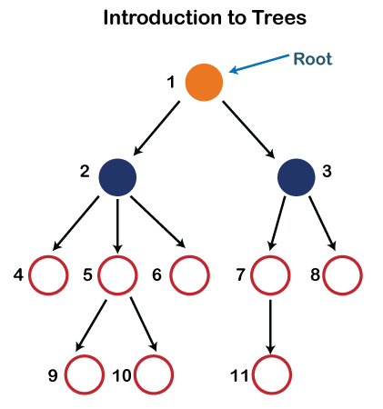

# Data Structure

## **Data Structure**
***
- Data Structure are fundamental concepts of computer science which helps us to write efficient program
- Organizing and storing data in a efficient form in the memory

### **Differents Types of Data Structure**
***
* **1. Primitve Data Structure**
* **2. Non- Primitive Data Structure**

- **Primitve Data Structure**
  - Predefine way of storing data
  - |         |
    |----|
    | int     |
    | char    |
    | float   |
    | double  |
    
- **Non-Primitve Data Structure**
  - Derive from primitive data structure
  - **Linear**
   - |       |
     |-------|
     | Array |
     | Linkedlist |
     | Stack |
     | Queue |
     
  - **Non-Linear**
   - |         |
     |---------|
     | Tree |
     | Graph |
     | Binary Tree |
     | Binary Search Tree |
     
 ### Operation perform on Data Structure
 ***
   - Searching
   - Sorting
   - Insertion
   - Deletion
   - Updation
   
 ### Areas where Data Structure use
 ***
   - Manage large amount of Data Efficiently
   - Internet Indexing services provided by Google
   - Hierarchical Data Model - Tree
   - RDBMS - Arrays
   - Network Data Model - Graph
   
  
 ### **Array**
 ***
   - Collection of elements of Homogeneous Data types
   - Size is fixed
   - Occupy Contiguous Memory Location
   - Searching O(1) Constant time
   - Indexes start from 0 & ends with Size - 1
   
- **Operations**
   - |Searching|
     |---------|
     | Linear Search |
     | Binary Search |
   - | Sorting  |
     |----------|
     | Insertion Sort |
     | Bubble Sort |
     | Radix Sort |
     | Merge Sort |
     | Binary Sort |
   - | Insertion |
     |-----------|
     | Insert at start |
     | Insert at end 
     | Insert at any specific location |
     
   - | Deletion |
     |----------|
     | Delete at start |
     | Delete at end |
     | Delete at any specific location |
   
 - ```code
      int arr[5];
      |  1 |  2  |  3  |  4  | 
      |5000|           | 5010|
      arr[0]           arr[4]
      base address 5000
   ```
   
- **Advantages of Array**
   - Similar Data type Element
   - Random Access with the help of index value
   - Suitable When Size is knowned
   - Implement Stack and Queue
   
- **Disadvantages of Arrays**
   - Static Memory Location
   - Specify the time at compile time, **Not Dynamic**
   - Insertion and Deletion -> More Complex / Time Complexity
   - Due to this we can't implement the list using arrays
   
 
 
### **LinkedList**
***
   - In LinkedList, elements stores at any location in the memory instead of contiguous like array
   - As its name indicates, There is a **Link** between one one element and other element which is called **Node**
   - ```code
        | Data | Link |
            Node
       value    Add of next node
                  that's why not required contiguous memory
               
        
        | 10 I 1000 | --> | 20 I 2000| --> | 30 I 3000| --> | 40 I NULL|
          Head                                                 Tail
          start node                                           end node
     ```
     
 
- **Advantages of LinkedList**
   - No Wastage of Memory
   - No need to contiguous memory
   - Insertion and deletion, more simpler than Array
   - Stack and Queue can be implemented by using LinkedList 
   - Can Store any data types in Node
   
- **Disadvantages Of LinkedList**
   - Random Access not possible
   - Binary Search Algorithm is not possible because of no index value
   - Only forward traversal is possible
   - Reversing a Linkedlist is complex, because change all links of all nodes
   - Extra pointer Require to store address for each node
  
* **Singly LinkedList**
  - A LinkedList or Singly LinkedList is a set of nodes where each nodes has two fields, **Data** and **Link**
  - ```code
     Data              Link
     Actual value       add of next node
     
    ```

* **Doubly LinkedList**
   - Doubly linkedList contains an extra pointer or link typically called previous node address with the next node address and a data field like singly LinkedList
   - ```code
          | 500 |  A  | 1000 |
       prev add   data   next add
        
     ```
* **Circular LinkedList**
   - Linkedlist where all nodes are connected to form a circle
   - There is no NULL at the end
   - A Circular LinkedList can be a singly LinkedList or Doubly LinkedList
   - ```code
         | 2 | x |-->| 3 | y |--->| 3 | z |--->| 2 | x |
     ```
     
- **Advantage of Circular LinkedList**
   - Any nde can be starting point
   - Traverse whole list by start at any point, just need to to stop when the first value is revisited
   - Useful for Queue implementation, we don't need to maintain two pointers for Front and Rear if we use circular LinkedList
   - Real Time Example, **Operating System** manages all running application through circular linkedList to give each of them a slice of time quantum to execute
   - Circular Doubly Linked Lists are used for implementation of advanced data structures like Fibonacci Heap.
   - Circular linked list is the basic idea of round robin scheduling algorithm
   


### **Stack**
***
   - Linear Data Structure
   - All the elemets are arrange in a sequential manner
   - Follows **LIFO** Last in First Out approach
   - Example - Arranging Bread in a Packet

- **Operations**
   - **Push**  - Inserting an element on the top of stack
   - **Pop**   - Deleting an element from the top of stack
   
   > ***Both opertion are perform on the top of stack***
  
   > **Top = -1 indicates Stack is Empty**
   
 - | **Overflow Condition** | **Underflow Condition** |
   |------------------------|-------------------------|
   |         PUSH           |        POP              |
   | If we are trying to insert element to stack when stack is already have maximum element | If we are trying to delete an element from stack when stack is empty already |


- **Implementation**
   - Using Array
   - Using LinkedList


### **Queue**
***
   - Linear Data Structure
   - ALl the elements are arrange in Sequential Manner
   - Follows **FIFO** First In First Out approach
   - Example - Railway Ticket Counter Queue
   
- **Operations**
   - **Enqueue** - Inserting an element into the Queue
   - **Dequeue** - Deleting an element from the Queue
   
   > **Front - Points to the starting element**
   > **Rare  - Points to the last element**
   - ***Enqueue will be done at Rare***
   - ***Dequeue will be done at Front***
   - | **Overflow** | **Underflow** |
     |--------------|---------------|
     | Trying to insert element into Queue when it is full | Trying to delete element from Queue when it is empty |
     
   - Initially **Front == Rear == -1** Empty Queue
   
- ```code                   Queue
        Delete <--- |    |    |    |    |............|     | <---- insert
                     front                            rear
                     dequeue                           enqueue
  ```
  
- **Implementation**
   - Using Array
   - Using LinkedList
   
 
- **Application of Stack**
     - Evaluation of a Post Expression
     - Conversion of Infix Expression to Postfix Expression and Vice Versa
     - Balancing the Parathesis
     
- **Prefix Expression**
     - Example +AB
     - ```code
          Operator <operand1> <operand2>
       ```

- **Infix Expression**
     - Example A+B
     - ```code
         <operand> Operator <operand>
       ```
 
- **Postfix Expression**
     - Example AB+
     - ```code
          <operand1> <operand2> Operator
       ```


## **Tree**
***
   - Non-Linear Data Stucture, in which data is organised in Hierarchical fashion
   - Represent hierarchical data.
   - Hierarchical structure as elements in a Tree are arranged in multiple levels
   - 
   
   > **Organizing the elements witout any closed region or loop is called as Tree otherwise it forms a Graph**
   
- ```code                     Top
                       A       | ------------------ Level 0
                               |
                  B        C   | ------------------ Level 1
                               |
             D    E    F       | ------------------ Level 2
                               |
                G    H         | ------------------ level 3
                               V
                             Bottom
  ```
  
- **Node**
   - ***Node means elements of a tree is called Node***
   - Example - A, B, C, D, E, F, G, H are Nodes of a tree

- **Root**
   - ***The starting element or Node of a tree is called Root Node***
   - Example A is the root node of the tree
   > **Tree will have only one Root Node**
   
- **Edge**
   - ***Edge is a link or connection between two nodes***
   > **If There are N nodes in a tree then N-1 Edges are there**
   - Example There are 8 nodes in the tree that's why 7 edges are there
   
   
- **Parent Node**
    - ***The node which is having branches, means Child is called as Parent Node***
    - Node with branches from top to bottom
    - ```code
                A (parent)
              /  \         
            B      C
           child   child
      ```
    - Example A is parent node of B and C
      
- **Child Node**
    - ***Node with edges from Bottom to Top or which has parent is called Child Node***
    - Example  B and C are the child node of A
    - Example B,C,D,E,F,G,H are the child node

- **Siblings**
    - ***Child Node of same parent is called as Siblings***
    - Example B and C are Siblings, D,E and F are siblings, G and H are also siblings


- **Leaf**
    - ***The node which is not having child is called Leaf Node***
    - Example D,C,F,G,H are leaf nodes


- **Internal or Intermediate Node**
    - ***All the nodes other than leaf node is called Internal Node***
    - Node with child and Parent is called Intermediate Node
    - Example B and E are internal nodes


- **Degree**
    - ***Number of child nodes represents the degree of a node***
    - Degree of A = 2
    - Degree of B = 3
    - Degree of E = 2
    > **Maximum Degree of all nodes is called Degree Of Tree**
    - Hence Degree of tree = 3

- **Level**
    - ***Every steps or Hierarchy in a tree is a level***
    - Level starts from 0
    - For Every step Hierarchy level will be incremented by 1
    - Example :
    - Level of the tree  = 3
    - Level of Root node = 0

- **Height**
    - Height means, we have find height for a particular node
    - ***Longest Path from leaf Node to that particular node is called Height***
    - ```code
             Particular Node
             ^
             |
             |                 Height
             |   
             Bottom
      ```
      
     - Height of B = 2 ( C <---> G <---> B )
     - Height of A = 3 ( C <---> G <---> B <---> A )

- **Depth**
    - ***Largest path from Root Node to that Node***
    - ```code
           Depth of E = 2 ( A <---> B <---> E )
           Depth of G = 3 ( A <---> B <---> E <---> G )
           Depth of B = 1 ( A <---> B )
      ```
      
- **Path**
    - ***Sequence of Nodes from source/root to leaf or destination***
    - Path from A to G  ->  A-B-E-G
    
- **Subtree**
    - ***Node with children forms Subtree***
    - ```code
             A
            / \
           B    C
         / | \
        D  E   F
          / \
         G   H
        
      ```
      
      
 ### **Binary Tree**
 ***
    - ***Binary Tree, Every Node n a tree should have at most 2 child node is called Binary Tree***
    - Atmost 2 means 0-Node or 1-Node or 2-Node
    - ```code
         A | A   |     A    |     A     |      A
           |  \  |   /  \   |   / | \   |     /  \
           |   B |  B    C  |  B  C  D  |    B     C
        Yes  Yes    Yes         No          / \   / \
                                           D   E  F  G
                                          / \
                                          H  I
                                           Yes
                                        
        ```
      
### **Different Types of Binary**
  - **Full Binary Tree / Strict Binary Tree**
  - **Almost Complete Binary Tree / Incomplete Binary Tree**
  - **Complete Binary Tree / Perfect Binary Tree**
  - **Left Skewed Binary Tree**
  - **Right Skewed Binary Tree**
